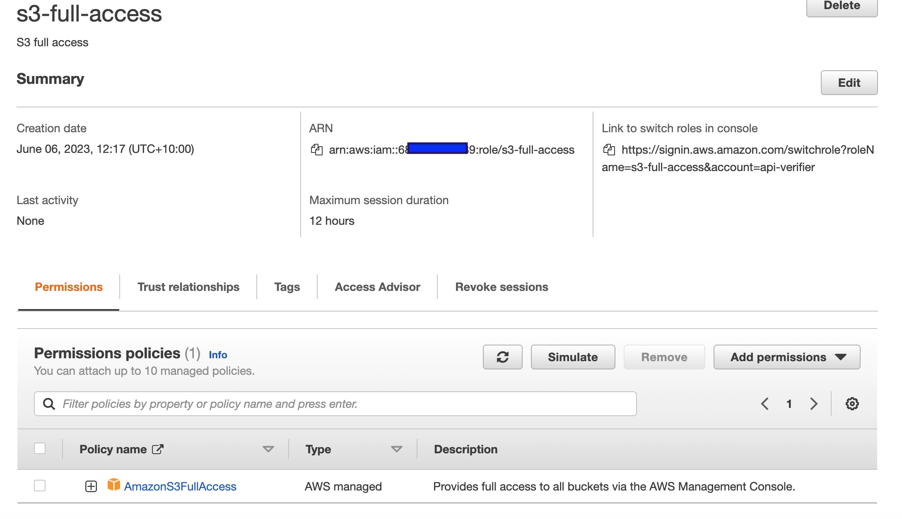
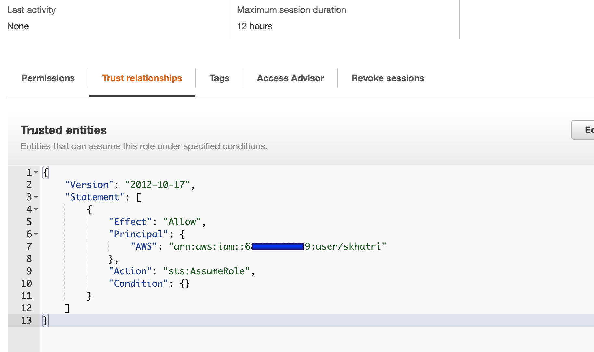

## AWS STS Policy Test

### Prep Work

Run DataGen App to generate test data using ```./gradlew run-data```

```shell
aws s3 mb s3://aws-sts-data-files
aws s3 cp aws-sts-data-files s3://aws-sts-data-files/ --recursive 
```

### Create IAM user
Create IAM user and generate secret which you save as profile "awssts" in 
~/.aws/credentials

```
[awssts]
aws_access_key_id = 
aws_secret_access_key = 
```

### Create s3-full-access role
I have given S3 Full Access permission


The IAM user can assume this role as shown in the trust relationships tab



### Generate Token
Export your AWS account id as AWS_ACCOUNT_ID or replace the variable in AwsStsGetToken.java
Run AwsStsGetToken using ```./gradlew run-token```

### Triggering Policy size issue
#### Scenario 1
Replace
```
      {
        "Effect": "Allow",
        "Action": ["s3:GetObject*"],
        "Resource": "arn:aws:s3:::aws-sts-data-files/questions/*/*"
      },
      
```
with 
``` 
      {
        "Effect": "Allow",
        "Action": ["s3:GetObject*"],
        "Resource": "arn:aws:s3:::aws-sts-data-files/questions/*-05-28/*"
      },
```
#### Scenario 2
Replace 
``` 
      {
        "Effect": "Allow",
        "Action": ["s3:Get*"],
        "Resource": "arn:aws:s3:::aws-sts-data-files/sports/*/*"
      },
```
with 
```
      {
        "Effect": "Allow",
        "Action": ["s3:Get*"],
        "Resource": "arn:aws:s3:::aws-sts-data-files/sports/**/*"
      },
```
